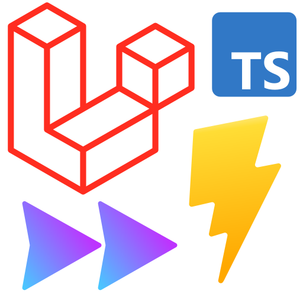

<p align="center">
  <a href="https://vitejs.dev" target="_blank" rel="noopener noreferrer">
    
  </a>
</p>

# Laravel RAD Stack

This modern monolith web starter kit, with only few features and separate front and admin parts, aims to have ready-to-go fullstack webapp with **high QA expectation** 📈 without sacrifice **[RAD](https://en.wikipedia.org/wiki/Rapid_application_development)** ⚡.

> Check [online demo 🌐](https://laravel-rad-stack.okami101.io) (read only mode)

While developing new ✨, reduce your ⏲ testing inside your browser thanks to **PHP Stan** 🧐 (static analysis tool) and **watchable tests suite written on Pest** ✅, a pleasant testing framework focused on simplicity. This boilerplate includes backend tests with 💯 coverage. **IDE helper for Laravel** 🐕‍🦺 is integrated. Finally **Clockwork** ⏱ is proposed as your perfect companion for advanced debugging & profiling.

On frontend side you'll be covered with **typescript instant feedbacks** 🚸. Typescript is fully integrated to **Vue 3** by usage of **composition API** as well as **[Vue TSC](https://github.com/johnsoncodehk/vue-tsc)** (from Volar plugin) for full TS support inside Vue templates. **Jest** is integrated for client side testing if needed, ideal for unit testing your Vue components.

> Say 🛑 to spending time on debugging and say 😎 to live **TDD** and proper **refactoring** ♻️ without being afraid of breaking your app !

For UI oriented development you'll still benefit of instant **Vite HMR** and **Windi CSS realtime classes scan** 👌. Fullstack RAD development on every stage ⚡ !

Besides all code is heavily linted from top to bottom thanks to **PHP CS Fixer** and **eslint prettier** 🎨.

> Say 🛑 to spending time on endless code style discussions !

## Technologies involved

- **Laravel 8** and **PHP 8.0** as minimum requirement. It allows usage of **PHP attributes** which is perfect for routing definitions directly inside controllers as Symfony does.
- Usage of **[Vite](https://vitejs.dev/)** as main frontend tooling for instant start and HMR development thanks to modern [esbuild bundler](https://github.com/evanw/esbuild) with proper Laravel manifest management for dev and production.
- **[Windi CSS](https://windicss.org/)** as main CSS framework for both front and admin parts.
- Front is empty but ready to go for full **Livewire + AlpineJS** integration. Perfect for SEO based websites. It's configured for Windi CSS and Typescript but you can easily switch to another tools.
- Basic admin UI fully build with **[Inertia](https://inertiajs.com/) + Windi CSS + Vue 3 Typescript with composition API**. Give thanks to Inertia for get ridding of boring Vue Router boilerplate and typescript for instant IDE feedbacks !
- Usage of last **[SFC script setup](https://v3.vuejs.org/api/sfc-script-setup.html#sfc-script-setup)** syntax since **Vue 3.2**. This syntax become similar to **Svelte** framework for even less code.
- Backend is tested by using **[Pest](https://pestphp.com/)** testing framework, which gives you a perfect starting dev point if you want to embrace **TDD**.
- **[GrumPHP](https://github.com/phpro/grumphp)** is preinstalled in order to automatize code formatting and testing before each commits. Use `vendor/bin/grumphp git:init` for auto register his git hooks commands.

### Why Windi CSS ?

It's fully written in Typescript and 100% compatible with Tailwind 2.x API. It has perfect integration with Vite + Typescript combo. Besides it's JIT from the ground up, which is ideal for HMR development. If you come from Tailwind, don't worry, nothing will really change for you and yes, it has dedicated plugin for [VSCode](https://windicss.org/editors/vscode.html).

## Features

Only simple basic features :

- Empty and easily removable front part, prepared with **Livewire and AlpineJS**.
- Dynamic on-demand image resizing via **Glide** with `$media->glide(['w' => 10, 'h' => 10, 'method' => 'fit'])->getUrl()`.
- Admin UI Layout with all **basic auth pages** (login / register / reset password / profile), **users management with impersonation** and **basic posts crud management**. All credits goes to [Laravel Jetstream](https://jetstream.laravel.com) and [Ping CRM](https://github.com/inertiajs/pingcrm).
- Clear separation between front and admin parts, with dedicated folders for controllers and resources and separated Vite configs. It's really simple to remove front part if you need only admin for CRM based application. **CSS purge and production builds** are properly configured for each front and admin part.
- **Admin RAD lightweight framework** similar to [React Admin](https://marmelab.com/react-admin/) with ready to use **crud pages**, **data table**, **fields** and **form inputs**. **Quick aside panel** view/edit with real inertia routing context is also supported and actually used for users management in this boilerplate !
- Extensible **DataTable** component with **paging**, **sorting**, **global search**, **by column filter**, **template columns**, **customizable row actions**, **excel export** features. All that with efficient and nice dev API !
- Advanced **BaseForm** proxy provider. No need for `v-model` on each field, just use unique `source` prop.

### Backend packages used

- [Laravel Fortify](https://github.com/laravel/fortify) for ready to used backend authentication endpoints.
- [Spatie Route Attributes](https://github.com/spatie/laravel-route-attributes) for direct routes definition inside controllers. No more heavy routes files !
- [Ziggy](https://github.com/tighten/ziggy) for Laravel routes names definitions accessible from client side.
- [Matice](https://github.com/GENL/matice) for nice Laravel translations integration within client side.
- [Laravel Excel](https://laravel-excel.com/) as perfect solution for data table Excel export.
- [Spatie Laravel Enum](https://github.com/spatie/laravel-enum) for proper enum support.
- [Spatie Query Builder](https://github.com/spatie/laravel-query-builder) as nice Eloquent builder for API REST resources browsing, totally bridged inside above DataTable component.
- [Glide](https://glide.thephpleague.com/) for dynamic image resizing.

## Dev tools for high QA

### Backend dev tools

- [Clockwork](https://github.com/itsgoingd/clockwork) for advanced profiling with debug bar and frontend metrics (**web vitals**) enabled. Can show **N+1 query** problems.
- [Laravel IDE Helper](https://github.com/barryvdh/laravel-ide-helper) for proper autocompletion, compatible with PHPStorm and VSCode Intelephense
- [PHP CS Fixer 3](friendsofphp/php-cs-fixer) configured for Laravel default styling.
- [Larastan](https://github.com/nunomaduro/larastan) for static PHP code analysis.
- [Pest](https://pestphp.com/) as enjoyable testing API.

### Frontend dev tools

- **Prettier** as opinionated code formatting and **Eslint** for proper typescript linting
- Full **Vue template typescript support** thanks to Johnson Chu's incredible work via his [Volar plugin](https://github.com/johnsoncodehk/volar). You finally now have typescript lint everywhere as Angular does with full VScode support !
- [Vite auto component register](https://github.com/antfu/vite-plugin-components) while keeping typescript props inferring functional !
- [Jest](https://jestjs.io/) ready to use for client side component / typescript unit testing. Note that unlike backend side there is no client unit tests provided to this boilerplate.

## Usage

### Local

Keep in mind that you must have **PHP 8.0** as minimum requirement.

```sh
composer install
# Prepare database and environment variables
php artisan key:generate
php artisan storage:link
php artisan elfinder:publish
php artisan migrate:fresh --seed
php artisan serve

# Finally launch frontend Vite HMR dev server
pnpm i
pnpm dev
```

Both front and admin dev HMR server will be started in parallel into different ports.

Front is empty, access to admin in <http://localhost:8000/admin> and login as `admin@example.com` / `password`.

#### Docker Sail

Sail is ready to go for easy docker integration. You should have set `alias sail='bash vendor/bin/sail'` before run `sail` command.

```sh
cp .env.example .env
composer install

# Launch all container services as daemon
sail up -d

# Prepare backend
sail php artisan key:generate
sail php artisan storage:link
sail php artisan elfinder:publish
sail php artisan migrate:fresh --seed

# Launch tests with coverage
sail composer test

# Finally launch frontend Vite HMR dev server on local with [PNPM](https://pnpm.io/fr/)
pnpm i
pnpm dev

# If on Windows WSL, set your WSL IP host (shown from previous command)
VITE_DEV_SERVER_HOST=wsl.host
```

### VSCode configuration

The essential plugins :

- [PHP Intelephense](https://marketplace.visualstudio.com/items?itemName=bmewburn.vscode-intelephense-client)
- [PHP CS Fixer](https://marketplace.visualstudio.com/items?itemName=junstyle.php-cs-fixer) > Don't forget to add `.php-cs-fixer.dist.php` file as config file.
- [PHPStan](https://github.com/swordev/phpstan-vscode) for realtime static analysis feedback per file.
- [EditorConfig](https://marketplace.visualstudio.com/items?itemName=EditorConfig.EditorConfig)
- [Eslint](https://marketplace.visualstudio.com/items?itemName=dbaeumer.vscode-eslint)
- [WindiCSS IntelliSense](https://marketplace.visualstudio.com/items?itemName=voorjaar.windicss-intellisense)
- [Volar](https://marketplace.visualstudio.com/items?itemName=johnsoncodehk.volar) for realtime typescript feedback inside your templates > You should disable vetur in order to avoid conflicts.
- [Error Lens](https://marketplace.visualstudio.com/items?itemName=usernamehw.errorlens) for inlined errors.

### Available QA scripts

```sh
composer format # PHP CS format
composer analyse # PHP static analysis

# Use custom env.testing file if needed for next line
composer test # Launch backend tests suite with console coverage report, and fail if less than 90% (adapt for your own needs)

pnpm lint --fix # TS & Vue files auto format
pnpm vue-tsc --noEmit # Full TS & Vue templates compiling report
pnpm test:unit # Launch client side unit testing suite
```

#### TDD ready

This project is ready to use within [Spatie PHPUnit Watcher](https://github.com/spatie/phpunit-watcher), which is perfect for **TDD** ! Just use `composer test:watch` command.

## License

This project is open-sourced software licensed under the [MIT license](https://adr1enbe4udou1n.mit-license.org).
